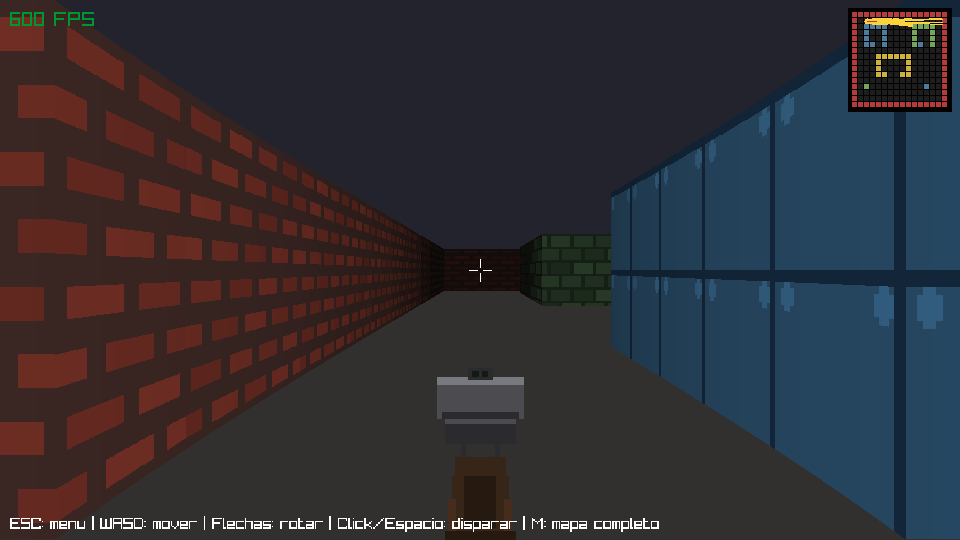

# Proyecto 1 - Rust Raycaster

Motor de *raycasting* estilo Wolfenstein 3D escrito en Rust con [raylib](https://www.raylib.com/).
Proyecto del curso de Gráficas por Computadora (UVG).



La escena 3D se genera lanzando un rayo por cada columna de pantalla sobre un mapa
de rejilla 16x16, usando el algoritmo DDA para encontrar la pared más cercana y
dibujando una columna de textura cuya altura depende de la distancia corregida
(*fisheye correction*). Todo el render ocurre en un framebuffer propio en memoria
(RGBA8) que se sube a una textura y se dibuja con **una sola llamada de dibujo**
por frame.

## Características

- **Renderizado por raycasting** con DDA, corrección de ojo de pez y sombreado por distancia.
- **Paredes texturizadas**: cuatro tipos de pared (valores 1-4 en el mapa), cada uno con su
  textura de 64x64 generada por código (ladrillo, panel metálico con remaches, piedra y
  panel dorado). Las caras norte/sur se oscurecen para dar sensación de volumen.
- **Framebuffer por software** (`framebuffer.rs`) con primitivas propias: `set_pixel`,
  `blend_pixel`, rectángulos, círculos y líneas (Bresenham).
- **Sprites animados** de 4 frames con proyección a pantalla, ordenamiento por distancia,
  transparencia y oclusión correcta contra las paredes mediante un *z-buffer* por columna.
- **Enemigos con respawn**: hay 3 enemigos activos; al morir reaparecen tras 4 segundos en
  el siguiente punto de spawn del nivel.
- **Arma en primera persona**: pistola dibujada por código con *bobbing* al caminar,
  retroceso al disparar, fogonazo (*muzzle flash*) y mira central.
- **Minimapa** en la esquina superior derecha con la posición y dirección del jugador.
- **Movimiento con colisión** (WASD), radio de colisión y deslizamiento por eje para no
  atravesar paredes.
- **Máquina de estados**: pantalla de bienvenida → selección de nivel → juego → pantalla de éxito.
- **Dos niveles** con distinto layout, posición inicial, puntos de spawn y casilla de meta.
- **Disparo** con click izquierdo o barra espaciadora: elimina el enemigo vivo más cercano
  dentro de un cono de 0.15 rad y 10 unidades de rango.
- **Grabador de GIF integrado** (`recorder.rs`): la primera vez que entras a un nivel se
  graba automáticamente `demo.gif` (8 segundos a 12 fps).
- Contador de FPS en pantalla (objetivo de 60 FPS con vsync), a 960x540.

## Requisitos

- Rust (edición 2021).
- Dependencias de compilación de raylib. En Ubuntu/Debian:

  ```bash
  sudo apt install build-essential cmake libasound2-dev libx11-dev libxrandr-dev \
      libxi-dev libgl1-mesa-dev libglu1-mesa-dev libxcursor-dev libxinerama-dev
  ```

## Cómo ejecutarlo

```bash
cargo run --release
```

El modo `--release` está configurado con `opt-level = 3` y LTO. El perfil `dev` también
sube el `opt-level` (2 para el proyecto, 3 para las dependencias) porque el raycasting
por software es muy sensible a las optimizaciones.

## Controles

| Acción | Tecla |
|---|---|
| Avanzar / retroceder | `W` / `S` |
| Desplazamiento lateral | `A` / `D` |
| Rotar la cámara | Flechas `←` `→` |
| Disparar | Click izquierdo o `Espacio` |
| Continuar (bienvenida) | `Enter` o `Espacio` |
| Navegar el menú de niveles | Flechas `↑` `↓` + `Enter` |
| Volver al menú desde el juego | `Esc` |
| Volver al menú desde la pantalla de éxito | `Enter` |

## Estructura del código

```
src/
├── main.rs         # Bucle principal, máquina de estados, input, disparo y pantallas de UI
├── state.rs        # Enum GameState (Welcome, LevelSelect, Playing, Success)
├── map.rs          # Rejillas de los niveles, struct Level y consultas de colisión/tipo de pared
├── player.rs       # Posición, ángulo, movimiento con colisión y rotación del jugador
├── raycasting.rs   # DDA, render texturizado de la escena 3D y del minimapa
├── sprite.rs       # AnimatedSprite (animación, muerte y respawn) y proyección con z-buffer
├── textures.rs     # Generación procedural de texturas de pared, pistola y criaturas
├── framebuffer.rs  # Framebuffer RGBA8 en CPU + primitivas de dibujo + subida a textura
├── weapon.rs       # Pistola en primera persona: bobbing, retroceso, fogonazo y mira
└── recorder.rs     # Grabador de GIF de demostración
```

### Cómo agregar o editar un nivel

Los mapas son matrices `[[u8; 16]; 16]` en `src/map.rs`. `0` es piso libre y `1`-`4`
son los tipos de pared (cada número usa una textura distinta, ver `WallTextures::get` en
`src/textures.rs`). Para agregar un nivel:

1. Define una nueva constante siguiendo el patrón de `LEVEL_1` / `LEVEL_2`.
2. Agrégala al `Vec<Level>` que devuelve `get_levels()`, indicando `name`,
   `player_start`, `player_start_angle`, `goal_tile` (la casilla `(col, fila)` que
   dispara la pantalla de éxito al pisarla) y `spawn_points` (las posiciones donde
   aparecen y reaparecen los enemigos).

Mantén el borde exterior con paredes: fuera del mapa se trata como pared, pero el
borde evita que el jugador vea "hacia afuera".

### Cómo agregar una textura

Las texturas no se cargan de disco: se generan en `src/textures.rs` dibujando sobre una
`Image` de raylib y luego se copian a un `PixelImage` (buffer de `Color` en CPU) para
poder muestrearlas pixel a pixel durante el raycasting. Para un nuevo tipo de pared,
escribe una función que devuelva una `Image` (como `brick_pattern`, `panel_pattern` o
`stone_pattern`), añádela a `WallTextures` y mapea su número en `WallTextures::get`.

## Pendientes

- Música de fondo y efecto de sonido al disparar.
- Texturas cargadas desde archivos de imagen en lugar de generadas por código.
- Enemigos con movimiento e IA: por ahora permanecen fijos en su punto de spawn.
